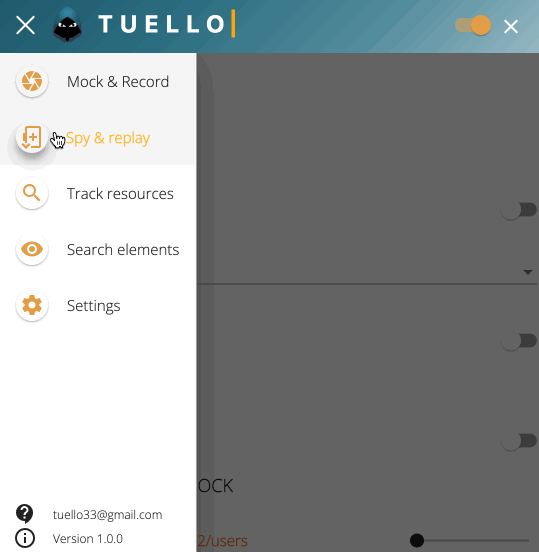

# Tuello

This browser extension is a set of tools that allow you to interact with the website you are visiting. 

Among other things, it allows you to

- Intercept and modify HTTP requests (xrh and fetch).
- Track HTML tags (e.g. \<h1>), HTML attributes (e.g. aria-labelledby) or text on the page. Tuello will highlight these elements directly in your HTML page as you navigate.
- Visualise a Json stream within the page and display it as a tree.
- Track resources consumed on the page or during a user click (e.g. XITI tags).
- Record and replay user's browser actions on the web page. When replaying, Tuello is able to visually compare them with those previously recorded.

> It is possible to disable Tuello while browsing and activate it only when you want to use it.

Tuello is fully free. You can thank the author by making a small donation  

